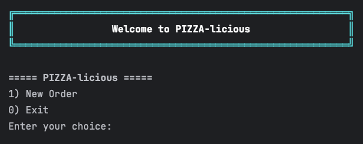
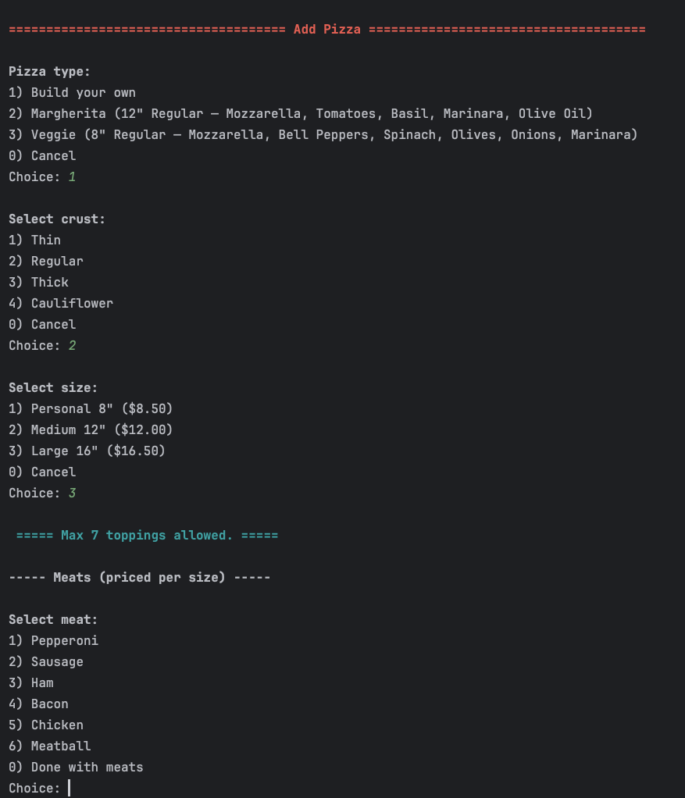
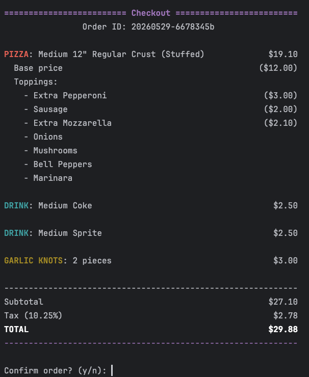
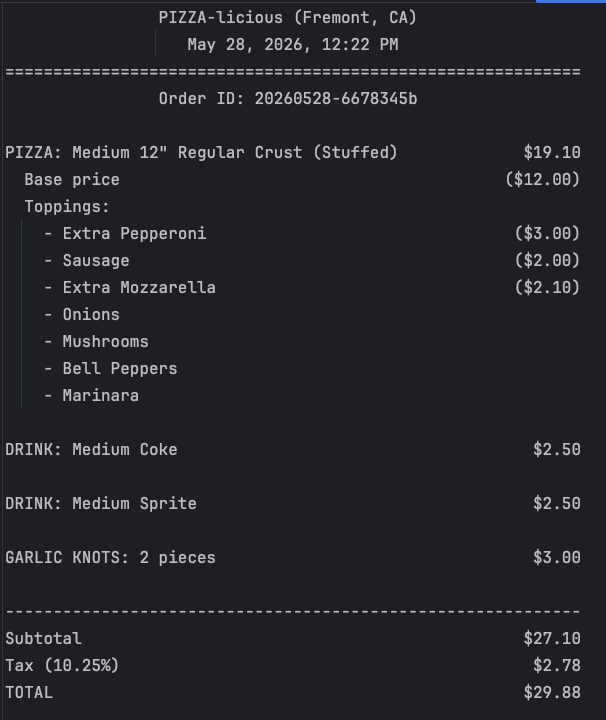
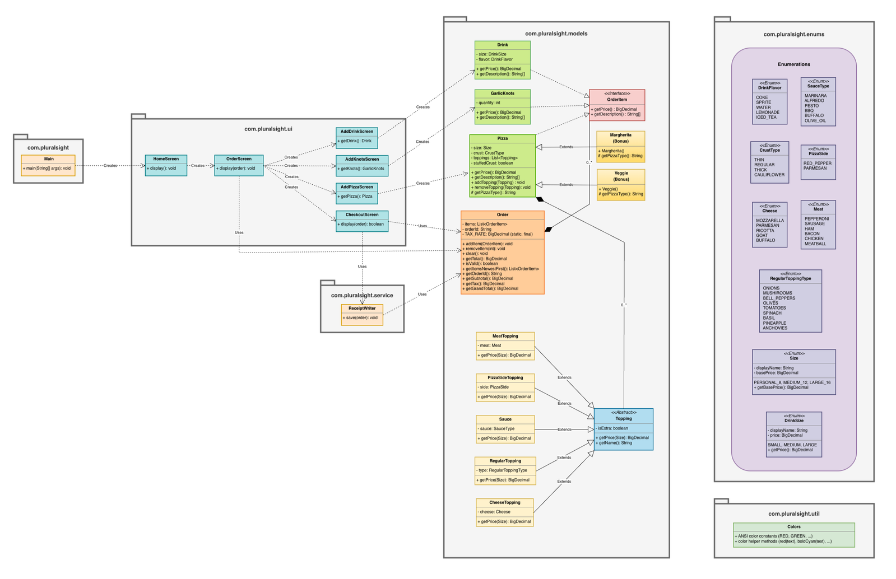

<div align="center">

# 🍕 pizza-licious

A console-based Point-of-Sale (POS) system for an imaginary pizza shop in Fremont, CA. <br/>
Customers can build custom pizzas, add drinks and garlic knots, and check out with a saved receipt — all from the terminal, with colored output.


</div>

> Capstone 2 project — Year Up LTCA Spring 2026, Java track.

---

## 📸 Screenshots

| Welcome / Home | Add Pizza |
|---|---|
|  |  |

| Checkout | Saved Receipt |
|---|---|
|  |  |

---

## ✨ Features

- 🍕 **Build a custom pizza** — size (8" / 12" / 16"), crust (thin / regular / thick / cauliflower / stuffed), multiple sauces, cheeses, meats, regular toppings, and pizza sides
- 💰 **Extra topping surcharges** — extra cheese and extra meat priced by size
- ⭐ **Signature pizzas** — preset Margherita and Veggie options
- 🥤 **Drinks and garlic knots** — round out the order
- 🛒 **Heterogeneous cart** — one order can mix pizzas, drinks, and knots
- 🥫 **Sauce required** — at least one sauce per pizza; the menu refuses to advance until you pick one
- 🧾 **Receipt with tax** — Subtotal / Tax (10.25% Fremont CA) / Total breakdown
- 💾 **Saved receipts** — each order writes a `.txt` file under `receipts/`
- 🆔 **Unique order ID** — `yyyyMMdd-<short UUID>` format
- 🎨 **Color terminal output** — ANSI color codes for a richer console experience

## ⚙️ Build and Run

Requires Java 17 and Maven.

```bash
mvn clean package
java -cp target/classes com.pluralsight.Main
```

## 🧪 Tests
The project ships with **6 JUnit 5 tests** across the model, ui, and util layers. All tests follow the **Arrange / Act / Assert** pattern, and currency assertions use `BigDecimal.compareTo` (not `equals`) to avoid scale mismatches.
| Test class | What it verifies |
|---|---|
| `models.PizzaTest` | A custom pizza's price equals base + all topping prices |
| `models.MargheritaTest` | The signature Margherita has a fixed expected price |
| `models.MeatToppingTest` | Extra meat adds the correct surcharge by size |
| `models.OrderTest` | A heterogeneous cart (pizza + drink + garlic knots) totals correctly |
| `ui.AddGarlicKnotsScreenTest` | The screen returns a `GarlicKnots` with the prompted quantity (stubbed `Scanner`) |
| `service.ReceiptWriterTest` | `save(order)` creates a new file under `receipts/` |
Run them all:
```bash
mvn test
```


## 📁 Project Structure

```
src/main/java/com/pluralsight/
├── Main.java                # entry point
├── models/                  # Pizza, Drink, GarlicKnots, Order, Topping hierarchy
├── ui/                      # HomeScreen, OrderScreen, AddPizzaScreen, ...
├── service/
│   └── ReceiptWriter.java   # writes order to receipts/*.txt
├── enums/                   # Size, CrustType, Cheese, Meat, Sauce types, ...
└── util/
    └── Colors.java          # ANSI color helpers
```

## 🧩 Class Diagram



---

## 💡 Interesting Piece of Code — the `OrderItem` interface

> [!TIP]
> The most interesting design decision in this project is the `OrderItem` interface. It is only two methods, but it is what makes the order cart **heterogeneous** — a single list can hold pizzas, drinks, and garlic knots together, and pricing, printing, and saving all work without ever checking concrete types.

### The interface

```java
public interface OrderItem {
    BigDecimal getPrice();
    String[] getDescription();
}
```

### The three implementations

```java
public class Pizza        implements OrderItem { ... }
public class Drink        implements OrderItem { ... }
public class GarlicKnots  implements OrderItem { ... }
```

### One list holds all three

```java
// inside Order.java
private List<OrderItem> items = new ArrayList<>();
```

### Totals don't care what's inside

```java
public BigDecimal getTotal() {
    BigDecimal total = BigDecimal.ZERO;
    for (OrderItem item : items) {
        total = total.add(item.getPrice());   // polymorphism: each type returns its own price
    }
    return total;
}
```

When a `Pizza` is in the loop, `item.getPrice()` runs Pizza's logic (size + crust + extra toppings). When a `Drink` is in the loop, it runs Drink's logic. Same loop, three different behaviors — that is polymorphism in action.

### Why this matters

If I wanted to add a new item type tomorrow (say, **Dessert**), I would:

1. Create `class Dessert implements OrderItem`
2. Implement `getPrice()` and `getDescription()`

That is it. `Order`, `ReceiptWriter`, `OrderScreen`, and `CheckoutScreen` would not change a single line. This is the **open/closed principle** — open for extension, closed for modification — and it is the same pattern Java itself uses for collections.

---

## ⚠️ Scope and Limitations

> [!NOTE]
> This is a single-session POS — no networking, no concurrent orders, no persistent customer accounts. Receipts are saved as plain text only (no PDF or JSON export). Tax is hardcoded to Fremont, CA's 10.25% rate; supporting other tax jurisdictions would require reading from a config file. There is no built-in order history viewer — past receipts can be read by opening files in `receipts/` directly.

A [sample receipt](docs/screenshots/04-receipt.png) is included in the repo so reviewers can see the output format without running the app.

---

## 🧰 Tech Stack

- **Java 17**
- **Maven**
- **JUnit 5**
- **`BigDecimal`** for currency math (never `double` for money)
- **ANSI escape codes** for color

## 👤 Author

**Junyong Jung** — Year Up LTCA Spring 2026